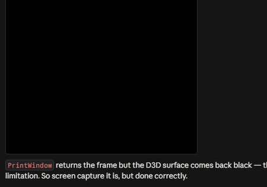

# Deep RL Banana Navigation

[](https://github.com/tropibyte/deep-rl-banana-navigation/actions/workflows/tests.yml)
[](https://www.python.org/)
[](LICENSE)

Value-based deep reinforcement learning agents that learn to collect bananas in
a Unity ML-Agents environment — from a vanilla DQN baseline up to a Rainbow-style
agent combining Double DQN, dueling heads, prioritized replay, n-step returns and
NoisyNet exploration.

The repository is built around a **controlled ablation**: every component is an
independent switch, each variant is trained across 5 random seeds, and results
are reported as medians with interquartile bands rather than a single lucky run.

**Result: the environment was solved in 67 episodes** by the best run, against a
project benchmark of 1800. All 35 runs across all 7 variants solved it. The
ablation also produced findings worth more than the headline — prioritized
replay *hurt* by 35% at un-retuned hyperparameters, three of the six components
were statistically indistinguishable from the baseline, and almost all of the
gain came from exploration. See [Report.md](Report.md).




---

## The environment

An agent moves through a large square arena filled with yellow and blue bananas.

| | |
|---|---|
| **Goal** | Collect yellow bananas, avoid blue ones |
| **Reward** | `+1` yellow banana, `-1` blue banana |
| **State space** | **37** continuous dimensions — agent velocity plus ray-based perception of objects in the forward direction |
| **Action space** | **4** discrete actions — `0` forward, `1` backward, `2` turn left, `3` turn right |
| **Episode** | Episodic, 300 steps |
| **Solved when** | Average score of **+13 over 100 consecutive episodes** |

This is the vector-observation build supplied by the Udacity Deep Reinforcement
Learning Nanodegree. It is similar to, but **not identical to**, the Banana
Collector environment in the upstream ML-Agents repository — use the download
links below rather than the upstream one.

---

## Getting started

### 1. Requirements

* **Python 3.10 or newer** (developed and tested on 3.11)
* No GPU required — these networks are small and train fine on CPU

The 2018 environment ships against Python 3.6, TensorFlow 1.7 and PyTorch 0.4.
**You do not need any of that.** This repo vendors a modernised ML-Agents v0.4
client in `vendor/` that runs on a current stack. See
[docs/PORTING.md](docs/PORTING.md) for exactly what was changed and why.

### 2. Download the Unity environment

Pick the build for your OS, unzip it into the repository root:

| OS | Download |
|---|---|
| Windows (64-bit) | [Banana_Windows_x86_64.zip](https://s3-us-west-1.amazonaws.com/udacity-drlnd/P1/Banana/Banana_Windows_x86_64.zip) |
| Windows (32-bit) | [Banana_Windows_x86.zip](https://s3-us-west-1.amazonaws.com/udacity-drlnd/P1/Banana/Banana_Windows_x86.zip) |
| macOS | [Banana.app.zip](https://s3-us-west-1.amazonaws.com/udacity-drlnd/P1/Banana/Banana.app.zip) |
| Linux | [Banana_Linux.zip](https://s3-us-west-1.amazonaws.com/udacity-drlnd/P1/Banana/Banana_Linux.zip) |
| Linux (headless) | [Banana_Linux_NoVis.zip](https://s3-us-west-1.amazonaws.com/udacity-drlnd/P1/Banana/Banana_Linux_NoVis.zip) |

The binary is deliberately **not** committed here. The code auto-detects it in
the repo root; alternatively set `BANANA_ENV_PATH` or pass `--env-path`.

### 3. Install

```bash
python -m venv .venv
.venv/Scripts/activate          # Windows
# source .venv/bin/activate     # macOS / Linux

pip install -e .
```

That installs `banana_nav` plus the vendored `unityagents` client and exposes
the `banana-train` command.

### 4. Verify the setup

```bash
banana-train train --config dqn --episodes 5
```

Five episodes of vanilla DQN. If the Unity brain prints `37` state dimensions
and `4` actions and episodes tick past, everything works.

---

## Usage

### Train one agent

```bash
banana-train train --config rainbow --seed 0 --episodes 900
```

Writes a checkpoint to `checkpoints/`, plus a per-episode CSV and a run summary
JSON to `results/runs/`. Available configs live in `configs/`:

| Config | What it adds to the baseline |
|---|---|
| `dqn` | nothing — vanilla DQN baseline |
| `double` | Double DQN |
| `dueling` | Dueling value/advantage head |
| `per` | Prioritized experience replay |
| `nstep` | 3-step returns |
| `noisy` | NoisyNet exploration (replaces epsilon-greedy) |
| `rainbow` | all of the above combined |

### Evaluate a checkpoint

```bash
banana-train eval --checkpoint checkpoints/rainbow_seed0.pth --episodes 100
```

Runs a fully greedy policy — no epsilon, no noise — and reports whether the mean
clears +13. Add `--graphics` to watch it play.

### Reproduce the full ablation

```bash
banana-train ablate --seeds 5 --episodes 900 --workers 6
```

Runs all 7 variants × 5 seeds as independent parallel processes. `--skip-existing`
makes it resumable. On an 8-core CPU machine this takes roughly 5 hours; drop
`--workers` to keep the machine usable for other things.

### Build the figures

```bash
banana-train plot --results results/ablation --out assets
```

### Record a GIF

```bash
banana-train record --checkpoint checkpoints/rainbow_showcase_final.pth --out assets/trained_agent.gif
```

The vector-observation build returns no visual observations, so there are no
frames inside the environment to save — the only way to film it is to run with
graphics and screen-capture the Unity window. That needs an **unlocked, active
desktop session** (a locked session captures solid black, which the recorder
detects and refuses). The capture is also clipped clear of the screen-right
strip where Windows draws notification toasts, since those are always-on-top
and would otherwise end up in the recording.

### Notebook

`Navigation.ipynb` walks through the environment interactively and reproduces a
short training run against the same library code.

---

## Results

See **[Report.md](Report.md)** for the learning algorithm, hyperparameters,
network architectures, the full ablation, and ideas for future work.

<!--RESULTS-SUMMARY-->
| Variant | Seeds | Solved | Median episodes | Mean +/- SD | Best 100-ep avg |
|---|---|---|---|---|---|
| Vanilla DQN (baseline) | 5 | 5/5 | **410** | 399 +/- 18 | 16.69 |
| + Double DQN | 5 | 5/5 | **392** | 396 +/- 20 | 16.48 |
| + Dueling head | 5 | 5/5 | **409** | 432 +/- 35 | 16.08 |
| + Prioritized replay | 5 | 5/5 | **555** | 569 +/- 51 | 16.06 |
| + 3-step returns | 5 | 5/5 | **407** | 395 +/- 22 | 16.96 |
| + NoisyNet | 5 | 5/5 | **189** | 228 +/- 70 | 17.90 |
| All combined | 5 | 5/5 | **134** | 203 +/- 176 | 16.65 |
<!--/RESULTS-SUMMARY-->

---

## How the code is organised

```
src/banana_nav/
    agent.py      DQN agent; every Rainbow component is an independent switch
    networks.py   Q-network with optional dueling head and NoisyLinear layers
    replay.py     Uniform + prioritized (sum-tree) buffers, n-step accumulator
    env.py        Gym-style wrapper over Unity ML-Agents v0.4
    train.py      Training loop, solve detection, run artifacts
    plotting.py   Figures
    record.py     GIF capture
    cli.py        banana-train entry point
    config.py     YAML experiment configs
configs/          One YAML per ablation variant
vendor/           Modernised ML-Agents v0.4 client (see docs/PORTING.md)
docs/PORTING.md   How the 2018 environment was brought to a current Python stack
```

### Design notes

**Components are orthogonal switches, not forks.** `AgentConfig` carries
`double`, `dueling`, `prioritized`, `noisy` and `n_step`. Every variant runs the
same code path, so an ablation changes exactly one thing at a time — the
measured difference is the component, not an incidental implementation
difference.

**Buffers are pre-allocated NumPy ring buffers**, not deques of namedtuples. At
100k transitions the per-object overhead of the latter dominates actual training
cost.

**Importance-sampling weights are always present**, fixed at 1.0 for uniform
replay, so the loss is one expression for both buffer types.

**Runs are separate OS processes**, which gives each one its own Unity process,
its own gRPC server, and a clean RNG state.

---

## Credits

Environment and project specification from the
[Udacity Deep Reinforcement Learning Nanodegree](https://github.com/udacity/Value-based-methods).
The vendored `unityagents` client is Unity Technologies' ML-Agents v0.4,
Apache 2.0 licensed, modified as documented in [docs/PORTING.md](docs/PORTING.md).

Algorithms implemented from:

* Mnih et al. (2015), *Human-level control through deep reinforcement learning*
* van Hasselt et al. (2016), *Deep RL with Double Q-learning*
* Wang et al. (2016), *Dueling Network Architectures for Deep RL*
* Schaul et al. (2016), *Prioritized Experience Replay*
* Fortunato et al. (2018), *Noisy Networks for Exploration*
* Hessel et al. (2018), *Rainbow: Combining Improvements in Deep RL*

## License

MIT for the code in `src/`, `configs/` and `scripts/`; see [LICENSE](LICENSE).
`vendor/` remains under Unity's Apache 2.0 license.
