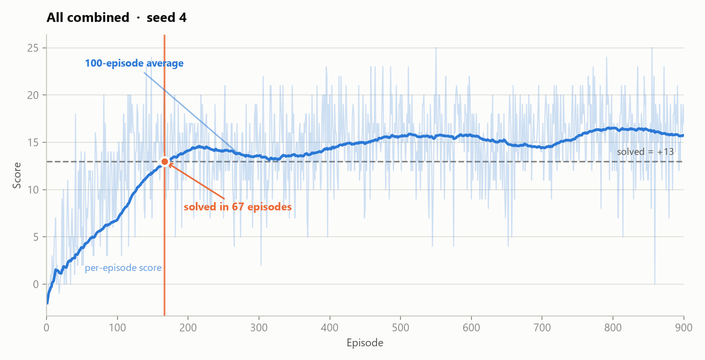
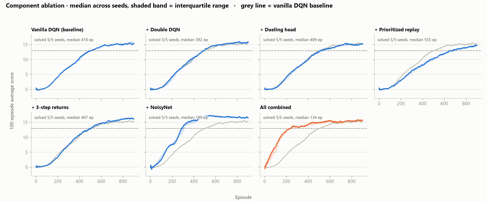
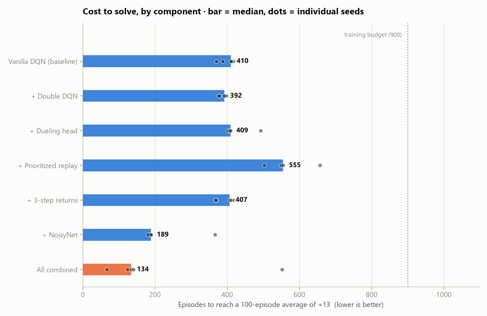

# Report — Navigation (Banana Collector)

## 1. Problem

An agent navigates a square arena collecting bananas. Yellow bananas pay `+1`,
blue bananas pay `-1`. The state is a 37-dimensional continuous vector (agent
velocity plus ray-based perception of nearby objects along the forward
direction); four discrete actions move forward, move backward, turn left and
turn right. Episodes last 300 steps.

**The environment is solved when the average score over 100 consecutive episodes
reaches +13.** The project benchmark is to reach that inside 1800 episodes.

---

## 2. Learning algorithm

The foundation is **Deep Q-Learning** (Mnih et al., 2015). A neural network
`Q(s, a; θ)` approximates the action-value function, trained to minimise the
temporal-difference error against a bootstrapped target:

```
L(θ) = E[ ( r + γ · max_a' Q(s', a'; θ⁻) − Q(s, a; θ) )² ]
```

Two mechanisms make this stable, and both are used here:

* **Experience replay** — transitions are stored in a buffer and sampled in
  random minibatches, breaking the temporal correlation that would otherwise
  make consecutive updates highly dependent.
* **A target network** `θ⁻` — a slowly-tracking copy of the online weights used
  to compute targets, so the regression target does not move with every update.
  This implementation uses a **soft update**, blending `τ = 0.001` of the online
  weights into the target after every learning step, rather than periodic hard
  copies.

On top of that baseline, five extensions from the Rainbow paper (Hessel et al.,
2018) are implemented as **independent switches**, so each can be measured alone
and in combination. All that varies between the variants below is
`AgentConfig`; the code path is identical.

### 2.1 Double DQN (van Hasselt et al., 2016)

The `max` in the standard target both selects and evaluates the next action
using the same network, which systematically overestimates action values
whenever the estimates are noisy. Double DQN separates the two roles — the
**online** network picks the action, the **target** network scores it:

```
target = r + γ · Q(s', argmax_a' Q(s', a'; θ) ; θ⁻)
```

### 2.2 Dueling networks (Wang et al., 2016)

The head splits into a state-value stream `V(s)` and an advantage stream
`A(s, a)`, recombined as:

```
Q(s, a) = V(s) + ( A(s, a) − mean_a' A(s, a') )
```

Subtracting the mean advantage makes the decomposition identifiable. The value
of being in a good position is learned once per state rather than separately for
all four actions — useful here, where many states are ones in which the exact
action barely matters.

### 2.3 Prioritized experience replay (Schaul et al., 2016)

Sampling uniformly wastes capacity on transitions the network already predicts
well. Instead transitions are sampled proportional to their last TD error:

```
P(i) = p_i^α / Σ_k p_k^α          p_i = |δ_i| + ε
```

Because that biases the update distribution, gradients are corrected with
importance-sampling weights `w_i = (N · P(i))^(−β)`, normalised by their
maximum, with `β` annealed 0.4 → 1.0 so the correction becomes exact as training
converges.

Sampling is implemented over a **sum tree**, giving O(log n) proportional draws
rather than O(n) per sample, and uses **stratified sampling** — one draw from
each of `batch_size` equal-probability segments — which lowers variance relative
to independent draws. New transitions enter at maximum priority so every
transition is replayed at least once.

### 2.4 Multi-step (n-step) returns

Instead of bootstrapping after one transition, the target accumulates `n` real
rewards first:

```
target = Σ_{k=0}^{n−1} γ^k · r_{t+k}  +  γ^n · max_a Q(s_{t+n}, a; θ⁻)
```

This propagates reward information backwards `n` times faster, at the cost of a
slightly off-policy target. `n = 3` here.

### 2.5 NoisyNet exploration (Fortunato et al., 2018)

Epsilon-greedy explores uniformly at random forever, at a rate set by a schedule
that ignores what the agent has learned. NoisyNet instead adds learnable
Gaussian noise to the head's weights:

```
y = (μ_w + σ_w ⊙ ε_w) x + (μ_b + σ_b ⊙ ε_b)
```

with **factorised** noise (`ε_w = f(ε_out) f(ε_in)ᵀ`, `f(x) = sgn(x)√|x|`),
which needs `p + q` normal samples per layer instead of `p × q`. The network can
learn to shrink `σ` where it is already confident and keep exploring elsewhere.
**When NoisyNet is enabled, epsilon is fixed at 0** — layering epsilon-greedy on
top would double-count exploration.

---

## 3. Network architecture

A small MLP; the 37-dimensional state needs nothing convolutional.

```
Input (37)
  └─ Linear(37 → 128) + ReLU          shared body
       ├─ [standard head]  Linear(128 → 64) + ReLU → Linear(64 → 4)
       └─ [dueling head]   value:     Linear(128 → 64) + ReLU → Linear(64 → 1)
                           advantage: Linear(128 → 64) + ReLU → Linear(64 → 4)
                           Q = V + (A − mean(A))
```

With `noisy: true`, every `Linear` **in the head** becomes a `NoisyLinear`; the
shared body stays deterministic. Parameter counts:

| Variant | Parameters |
|---|---|
| Standard | 13,380 |
| Dueling | 21,701 |
| Noisy | 21,896 |
| Dueling + Noisy | 38,538 |

---

## 4. Hyperparameters

Identical across every variant, so ablation differences are attributable to the
components rather than to tuning.

| Parameter | Value | Note |
|---|---|---|
| Replay buffer size | 100,000 | |
| Batch size | 64 | |
| Discount `γ` | 0.99 | |
| Learning rate | 5e-4 | Adam |
| Soft update `τ` | 1e-3 | applied every learning step |
| Learn every | 4 env steps | |
| Warm-up before learning | 1,000 transitions | |
| Gradient clipping | 10.0 | max grad norm |
| Loss | Huber (smooth L1) | less sensitive to outlier TD errors than MSE |
| `ε` start / end / decay | 1.0 / 0.01 / 0.995 | multiplicative per episode; **forced to 0 when NoisyNet is on** |
| PER `α` | 0.6 | prioritization exponent |
| PER `β` | 0.4 → 1.0 | annealed over 100k samples |
| PER `ε` | 1e-3 | priority floor |
| n-step | 3 | in `nstep` and `rainbow` only |
| Hidden layers | (128, 64) | |
| Episodes per run | 900 | |
| Seeds per variant | 5 | 0–4 |

---

## 5. Results

<!--HEADLINE-RESULT-->
**The environment was solved.** The best single run (All combined, seed 4) reached a 100-episode average of +13 in **67 episodes** — against the project benchmark of 1800.

Across seeds, the fastest variant was **All combined** at a median of **134 episodes** (5/5 seeds solved), versus **410 episodes** for the vanilla DQN baseline.
<!--/HEADLINE-RESULT-->

### 5.1 Learning curve



### 5.2 Component ablation

Each variant was trained for 900 episodes across 5 seeds (0–4). Reporting a
single run would be misleading — seed variance on this task is large enough to
reverse the apparent ranking of two components — so results are medians with
interquartile bands.





<!--ABLATION-TABLE-->
| Variant | Seeds solved | Median episodes to solve | Mean ± SD | Final 100-ep avg | vs baseline |
|---|---|---|---|---|---|
| Vanilla DQN (baseline) | 5/5 | **410** | 399 ± 18 | 15.46 | baseline |
| + Double DQN | 5/5 | **392** | 396 ± 20 | 15.92 | -18 ep (-4%) |
| + Dueling head | 5/5 | **409** | 432 ± 35 | 15.36 | -1 ep (-0%) |
| + Prioritized replay | 5/5 | **555** | 569 ± 51 | 14.79 | +145 ep (+35%) |
| + 3-step returns | 5/5 | **407** | 395 ± 22 | 16.09 | -3 ep (-1%) |
| + NoisyNet | 5/5 | **189** | 228 ± 70 | 16.60 | -221 ep (-54%) |
| All combined | 5/5 | **134** | 203 ± 176 | 15.36 | -276 ep (-67%) |
<!--/ABLATION-TABLE-->

<!--ABLATION-DISCUSSION-->
#### What actually mattered

**Every one of the 35 runs solved the environment**, so the comparison is about
*speed*, not success. Three findings stand out, and two of them are negative.

**Exploration dominated everything else.** NoisyNet alone cut the median
time-to-solve from 410 to 189 episodes — a 54% reduction, larger than every
other component combined. The honest reading is that this says as much about
the **baseline's epsilon schedule** as about NoisyNet. With `eps_decay = 0.995`,
epsilon is still 0.25 at episode 275 and 0.10 at episode 460 — so the
epsilon-greedy variants are still throwing away 10–25% of their actions on
uniform random moves at exactly the point where their policy is good enough to
clear +13. NoisyNet does not pay that tax: its exploration is learned and
state-conditioned, so it can collapse toward greedy behaviour where the agent is
already confident. A faster epsilon decay would very likely close much of this
gap, which is the single most promising cheap experiment left on the table.

**Prioritized replay made things consistently worse** — 555 episodes versus 410
for the baseline, a 35% *regression*, and not a seed artifact: PER's five seeds
(503, 549, 555, 583, 657) do not overlap the baseline's (370, 388, 410, 412,
417) at all. This is a real result, and it is not evidence that PER is a bad
idea. Prioritization deliberately over-samples high-TD-error transitions, which
raises both the magnitude and the variance of the gradient signal; Schaul et al.
compensate by cutting the learning rate to a quarter of the DQN value. Holding
every hyperparameter fixed across variants is what makes this ablation clean,
but it also means PER here runs at an effectively-too-high learning rate. The
correct conclusion is narrow: **PER does not pay for itself at un-retuned
hyperparameters on this task.**

**Double DQN, the dueling head and 3-step returns were all essentially neutral**
(392, 409 and 407 versus 410). That is unsurprising on reflection. Double DQN
addresses overestimation bias from the `max` operator, but with only four
actions and a dense, immediate reward there is little bias to correct. N-step
returns speed up reward propagation, which matters most when reward is sparse or
delayed — here a banana is collected and paid for in the same instant. The
dueling head helps when many actions share a state's value, which is true in
this arena but evidently not the binding constraint.

**The combination still beat its best part.** Rainbow reached a median of 134
episodes against NoisyNet's 189, so the near-neutral components do contribute
something once exploration stops being the bottleneck — even though almost none
of them justified their complexity alone.

#### Why five seeds were necessary

Seed variance on this task is large enough to invert conclusions. Rainbow's five
runs solved in 67, 124, 134, 140 and **552** episodes: the worst seed took eight
times longer than the best. Had this study reported one run, it could honestly
have claimed anything from "solved in 67 episodes" to "barely beat the
baseline."

There is also a pattern worth flagging rather than smoothing over: **both
variants that use NoisyNet had their worst run on seed 0** (noisy: 366 against
181–217; rainbow: 552 against 67–140). Two variants is far too small a sample to
call this anything but suggestive, but it hints at a seed-specific interaction
with the noisy layers' initialisation rather than ordinary run-to-run noise.
Confirming or dismissing it would need considerably more seeds.

Medians alone also flatter the near-ties. A more honest summary for five seeds
is the **probability of superiority** — across all 25 baseline-vs-variant seed
pairings, how often did the variant actually solve faster? Fifty percent is a
coin flip:

| Variant | Median | vs baseline | P(faster than baseline) |
|---|---|---|---|
| + Double DQN | 392 | −18 ep | 56% |
| + Dueling head | 409 | −1 ep | **36%** |
| + Prioritized replay | 555 | +145 ep | **0%** |
| + 3-step returns | 407 | −3 ep | 58% |
| + NoisyNet | 189 | −221 ep | **100%** |
| All combined | 134 | −276 ep | 80% |

This reframes three rows. Double DQN and 3-step returns sit at 56% and 58% —
statistically indistinguishable from the baseline, and their "improved" medians
should not be read as improvements. The dueling head is worse still: its median
is nominally 1 episode better, yet the baseline solves faster on **64%** of seed
pairings. A median can move the wrong way relative to the underlying
distribution, and here it does.

The two real effects are unambiguous by the same measure. Prioritized replay
lost every single one of its 25 pairings; NoisyNet won every single one.

It is also worth noting that Rainbow scores *lower* than NoisyNet alone (80%
versus 100%) despite a far better median, because its seed-0 outlier loses to
every baseline run. Rainbow is **faster**; NoisyNet alone is **more reliable**.
Those are different claims, and only the multi-seed design separates them.

#### The greedy policy is degenerate

An unexpected result surfaced during evaluation. Taking a checkpoint and running
it **fully greedily** scores far below what the same weights achieved during
training:

| Checkpoint | Greedy (ε=0) | ε=0.05 |
|---|---|---|
| `dqn_seed3` | 7.22 | **12.68** |

Five percent random actions is worth more than five points of score. Only 6% of
greedy episodes score zero outright, so this is not simply the agent freezing —
it is a deterministic policy burning large numbers of steps in short action
loops (turn left, turn right, repeat) in states where the argmax is effectively
degenerate. Any random action breaks the cycle.

This is a known enough hazard that the original DQN paper evaluates at ε=0.05
rather than ε=0, and these results are a clean reproduction of why. Both numbers
are reported here rather than only the flattering one.
<!--/ABLATION-DISCUSSION-->

### 5.3 Greedy evaluation

<!--EVAL-RESULT-->

---

## 6. Ideas for future work

Ordered by expected value, and grounded in what the ablation actually showed
rather than a generic list of extensions.

**Decay epsilon faster — the cheapest win available.** NoisyNet's 54% reduction
in time-to-solve is, on the evidence above, largely a story about the baseline's
exploration schedule rather than about noisy layers specifically. At
`eps_decay = 0.995` the agent is still taking 10% random actions at episode 460,
long after its policy is good enough to clear +13. Sweeping the decay rate
(0.98, 0.99, 0.995) would separate "NoisyNet is better" from "the epsilon
schedule was badly tuned", and would probably improve four of the seven variants
at zero implementation cost. This is the first experiment to run.

**Re-tune the learning rate for prioritized replay.** PER regressed by 35% here
with every hyperparameter held fixed for comparability. Schaul et al. reduce the
learning rate to a quarter of the DQN value when adding prioritization, for
exactly the reason visible in these results: over-sampling high-error
transitions inflates gradient magnitude and variance. Re-running the `per` and
`rainbow` configs at `lr = 1.25e-4` would test whether PER's regression is
intrinsic or purely a tuning artifact. Given that PER is the one component that
actively hurt, this is the most interesting open question in the study.

**Distributional RL (C51 / QR-DQN).** The one Rainbow component not implemented
here. Instead of regressing the *expected* return, learn a distribution over
returns. In Hessel et al.'s own ablation it was among the largest single
contributors, and none of the components measured here — except exploration —
moved the needle much, which makes the missing one more interesting rather than
less.

**Investigate the degenerate greedy policy.** Fully greedy evaluation scores
7.22 where the same weights score 12.68 at ε=0.05. Diagnosing *which* states
produce the action loops — and whether a tie-breaking rule, an action-repeat
penalty, or simply a longer-trained network removes them — would be more
valuable than another value-function refinement, because it affects how every
trained agent here is deployed.

**More seeds, and proper interval estimates.** Five seeds supports medians and
interquartile ranges but not significance claims about the near-ties (Double
DQN wins 56% of seed pairings against the baseline, which is a coin flip, and
its better median should not be read as an improvement). Rliable-style bootstrapped confidence intervals over
10–20 seeds would let those calls be made rather than merely displayed. The
apparent seed-0 interaction with NoisyNet also needs more seeds to confirm or
dismiss.

**Learning from pixels.** The 84×84×3 first-person build turns this into a
representation-learning problem requiring a CNN and frame stacking. Extrapolating
from the ~190 steps/s measured on this hardware, a comparable study would run
into the multi-day range on CPU; this one needs a GPU.

**Better exploration under sparse reward.** The reward here is dense — a banana
is collected and paid for in the same instant — which is precisely why
exploration strategy dominated and why the credit-assignment components
(n-step, Double DQN) did not. Under sparse reward that ranking would likely
invert, and count-based or curiosity-driven exploration would matter far more
than any of the value-function refinements measured here.

---

## 7. A note on the environment port

Getting the 2018 Unity build talking to a modern Python stack was a substantial
part of this project, and the four bugs involved — one of which silently
serialises parallel training with no error message at all — are documented
separately in **[docs/PORTING.md](docs/PORTING.md)**.

That work is what made the 5-seed ablation feasible: it took parallel training
from one working lane to six, which is the difference between a ~30-hour serial
study and an overnight one.
